(This is a markdown version of a post originally published on Medium. Please forgive the awkward formatting.)

## Visualizing the Geometric and Harmonic Means

Long after I learned how to _calculate_ the geometric and harmonic means, I was still unclear about what exactly they were doing for me. I ended up clarifying this to myself by generating a series of visualizations which I’ll show you in this post.

First, a quick review of the algorithms themselves.

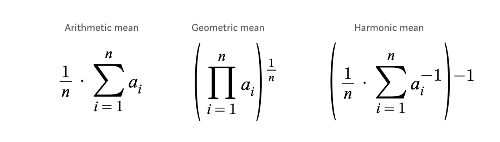
The Pythagorean means. 𝑎 is a tuple/array/list. 𝑛 is the length of 𝑎. ([∑ notation](https://en.wikipedia.org/wiki/Summation#Capital-sigma_notation)) ([∏ notation](https://en.wikipedia.org/wiki/Multiplication#Capital_pi_notation))

The __arithmetic mean__ is what people are usually talking about when they say “average”. By far the most widely used, it’s simple to calculate. You sum the parts, then divide by how many there were.

The __geometric mean__ has the same procedure but different operations. You _multiply_ the parts, then take the _root_ corresponding to how many there were. The geometric mean is often used when finding the mean of data which are measured in different units.

The __harmonic mean__ is the arithmetic mean with two extra steps. First, find the multiplicative inverse of each number (for _x_, that’s 1 ÷ _x_, or _x_ ⁻¹). Then sum and divide those inverses like you would for the arithmetic mean. Then, take the inverse again. The harmonic mean is used to calculate [F₁ score](https://en.wikipedia.org/wiki/F1_score).

To my eye, all the exponents jammed into the harmonic mean made it seem uglier than the other two. But as we’ll see, it’s exactly that exponentiation that will help unify our understanding of all three.

#### A Gripping Plot

The arithmetic mean

This plot shows the result of taking the arithmetic mean of two numbers. Each axis represents one of the numbers, and the shade of gray at each point represents the mean of the two.

The order of the two numbers doesn’t matter, so the axes are interchangeable.

All the plots we’ll look at today have the interesting property that their shape doesn’t change when you multiply all the numbers on their axes by the same factor[^1]. That means you can zoom in or out on the plot above and, as long as you keep the point _(0, 0)_ in the lower left corner, it won’t look any different. (You’d also have to adjust the color scale, but it’s arbitrary anyway.) So from now on, instead of thinking about specific numbers, we can just think about what _every_ plot with the origin in the lower left corner looks like:

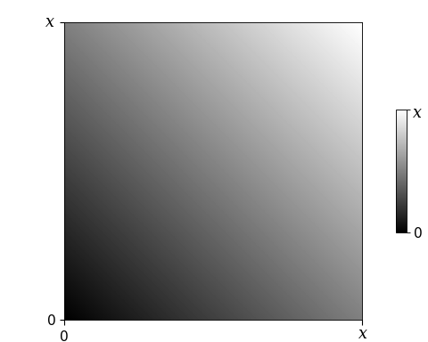
The arithmetic mean, agnostic to scale. 𝑥 can be any positive number.

To make it easier to see what’s going on, I’ll paint means that are close together the same shade:

The arithmetic mean

Each stripe contains many pairs of numbers which have means within the same range. You can now see that the mean doesn’t change as long as you go along a straight, 45° line. That is, __when you take some quantity away from one of the numbers, the arithmetic mean remains the same as long as you increase the other number by the same amount.__

Now I’ll plot the geometric mean the same way.

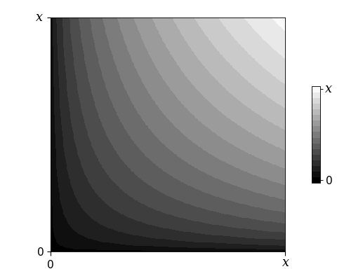
The geometric mean

We can immediately see the difference.

__It’s a little darker.__ The geometric mean is always lower than or equal to the arithmetic mean.

__It’s curved.__ An equal trade off between the two numbers no longer preserves their mean.

Because of the _direction_ it curves in, __pairs that are further apart from each other have _lower_ means than those closer together.__ To clarify that, let’s look at the arithmetic and geometric means side by side:

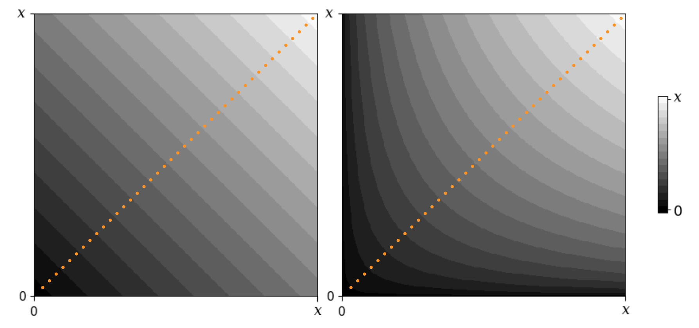
Arithmetic vs. geometric mean

Along the line traced in orange above, the two numbers we’re finding the mean of are the same. Whether arithmetic or geometric, the mean of two identical numbers is just that same number. So along the diagonal these images match perfectly, while on either side of it they obviously do not.

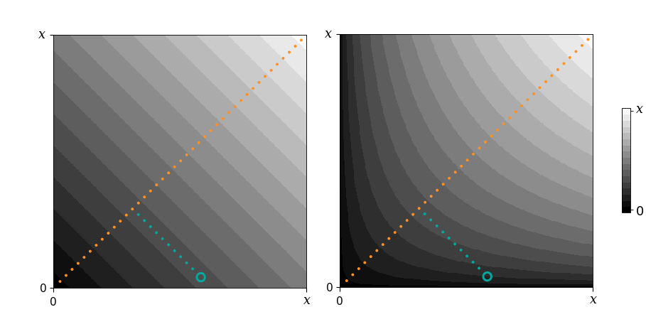
Arithmetic vs. geometric mean

The point circled in teal represents the mean of two numbers with a large difference between them. When using the arithmetic mean (left), this point has the same value as the point 45° away from it on the orange line. But with the geometric mean (right), the values further away from the orange line bend outwards, producing a lower mean for the same point.

Now the harmonic mean:

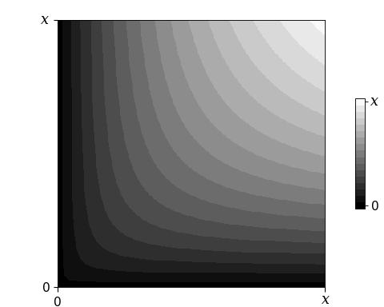
The harmonic mean

It looks similar to the geometric. Let’s plot them side by side:

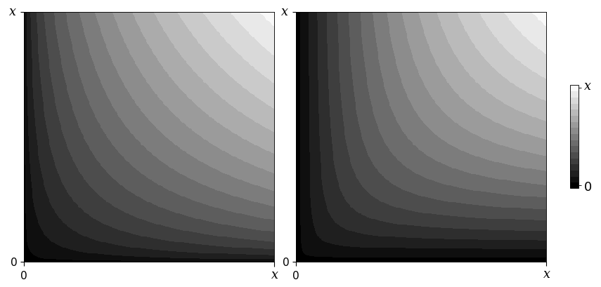
Geometric vs. harmonic mean

Again, they’re the same on the diagonal. But off to the side of the diagonal the harmonic mean is _more curved_ than the geometric, and gives even lower results for pairs that are further apart from each other.

So the arithmetic mean has no curve, the geometric mean has some, and the harmonic mean has even more. The difference between them is in large part a matter of degree—of how outwardly curved they are. The stronger the curve, the lower the results of that mean when provided with dissimilar numbers. We can understand this better if we consider _all the other_ degrees of curvature a mean can have.

#### Generalized Means Primer

All three Pythagorean means belong to a wider class of functions called [generalized means](https://en.wikipedia.org/wiki/Generalized_mean). (These are closely related to the idea of [Lᵖ spaces](https://en.wikipedia.org/wiki/Lp_space), so if you’re already comfortable with Lᵖ spaces it might be easier to think of these images as segments of circles centered on the origin in spaces of varying _p_.)

The equation for the generalized mean looks like the harmonic mean, but with the exponents replaced by a variable, conventionally _p_:

The generalized mean

Or, algorithmically:

1. Take everything to the _p_ ᵗʰ power
2. Find the arithmetic mean as you normally would
3. Take the result to the _p_ ⁻¹ᵗʰ power (find the _p_ ᵗʰ root)

When _p_ is one, the first and last steps have no effect, so you’ve found the arithmetic mean.

When _p_ is negative one, this equation simplifies to the equation for the harmonic mean.

It turns out the geometric mean is the limit of the generalized mean as p approaches zero. I won’t go through the proof for this because it would take too long and because I haven’t read it, but understand that the geometric mean lives in the same neighborhood as zero.

(There is no generalized mean at zero due to division by zero.)

OK, now we can visualize the generalized mean for any value of _p_.

#### All Means Possible

First, let’s retrace the steps we’ve already taken. We’ll start with the arithmetic mean and go down, pass the geometric mean at zero, and end with the harmonic mean at negative one.

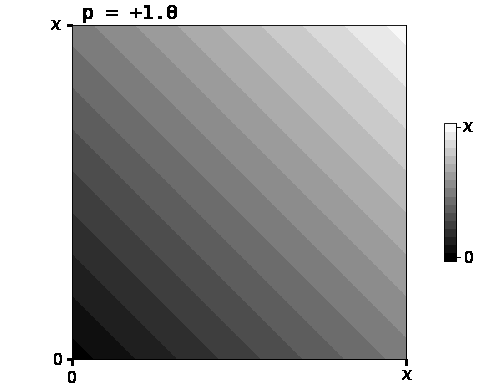
_(If this is blurry it’s still downloading.)_

Let’s keep going down.

As p approaches negative infinity, the contours become straight lines:

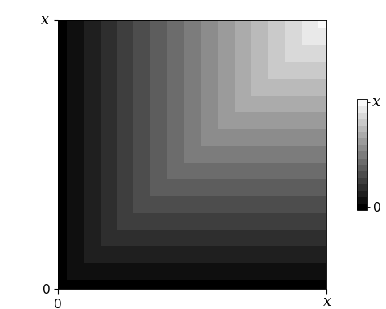
The generalized mean as p approaches negative infinity, i.e., the minimum function

At this point the generalized mean becomes the function that returns the minimum of the two numbers it’s given. Notice how the result depends entirely on whichever number is lower.

OK, let’s go back to the arithmetic mean and travel in the opposite direction.

__It gets lighter.__ The value is always equal to or higher than the arithmetic mean.

__It curves the other way.__ Numbers that are further apart now have _higher_ means than those closer together.

When _p_ is two, the generalized mean is called the quadratic mean.

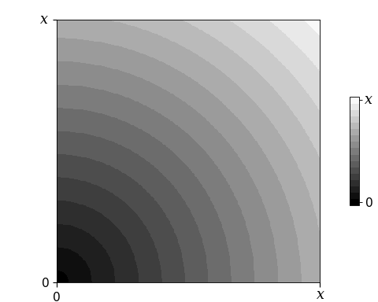
The quadratic mean

We use the quadratic mean often in statistics. The quadratic mean of some deviations is a standard deviation. The quadratic mean of some errors is a root-mean-square error, a name which explicitly describes the three steps listed earlier in the algorithm for the generalized mean.

Notably, at this point the stripes are perfectly round, but that’s just a side effect of your screen existing at a scale where the world deceptively appears to be a Euclidean space. 🤯

Let’s keep going up.

As _p_ approaches positive infinity, the contours again become straight lines, and the mean becomes the maximum.

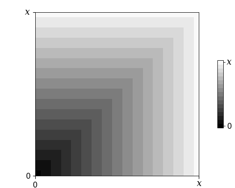
The maximum function

Finally, let’s see the whole thing.

__You can think of generalized means as leaning in one direction or the other, either rewarding or punishing difference between the numbers they’re given.__

In some situations you might need to use a mean with properties unique to that specific value of _p_. But for many applications, the important part is just whether _p_ is at, below, or above one, which determines _whether_ it curves and _which direction_ it curves in.

I hope these animations above have given you a better intuition about what’s happening when you use a mean. If you have any corrections or insight to provide please leave a comment.

❈ ❈ ❈

[My personal site](http://www.lukepersola.com/)

I generated the images in [this notebook](https://github.com/Persola/visualize-generalized-means) (matplotlib, imageio).

Thanks to [Sam Pierce Lolla](https://sampiercelolla.com/) for help editing.

[^1]: Because generalized means are [homogeneous functions](https://en.wikipedia.org/wiki/Homogeneous_function) of degree one.
